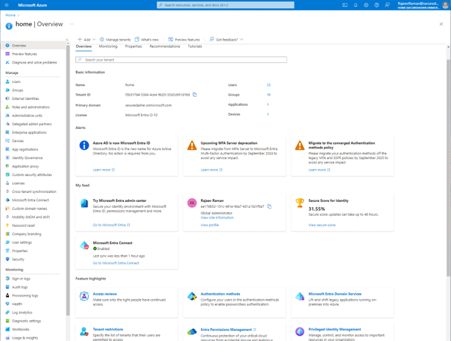
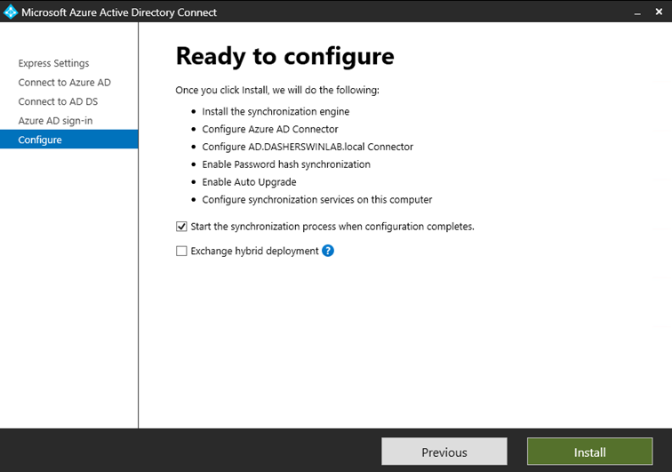
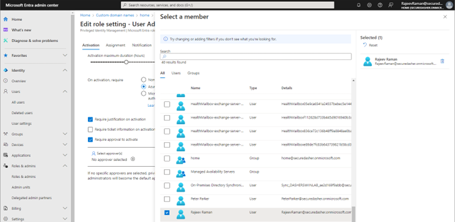
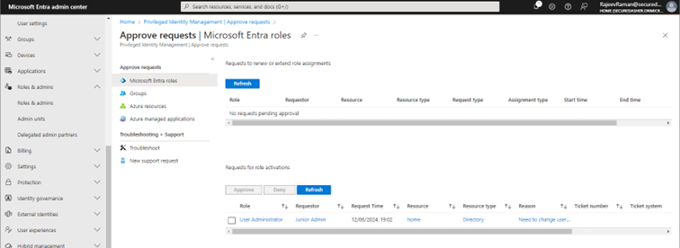

# Microsoft Cloud Administration With Entra (Azure)

## Overview
Welcome to my home lab setup, "Dashershomelab". This environment is designed to help understand various aspects of networking, monitoring, prevention, administration, and hardening techniques.

### Microsoft Enterprise Mobility + Security

**Enterprise Mobility + Security (EMS)** from Microsoft is a comprehensive suite designed to help organizations manage and secure their mobile devices, applications, and data. EMS integrates with Microsoft's cloud services and provides a range of tools for identity and access management, information protection, and device management.

## Lab Focus: Privileged Identity Management (PIM)
In this lab, we'll delve into Microsoft Entra ID, Intune, Purview, and other cloud services. We'll focus on understanding Microsoft Cloud Administration and PIM.

### Goals:
- Understand Microsoft Cloud Administration
- Explore Microsoft Entra ID (formerly Azure AD)
- Learn about Microsoft Privileged Identity Management (PIM)

### Prerequisites:
- Azure account and Subscription
- EMS + E3 (Enterprise Mobility and Security) License
- Windows 10 or later PC managed by Intune / Entra

## Setting Up Your Azure Account

1. **Create an Azure Account**
   - Visit [Azure Portal](https://Portal.azure.com) and create an account.
   - Follow the instructions to register. You will get access to the Azure portal with $200 credit for one month.
   - Once logged in with your Microsoft credentials, you will find the Azure Home page.

2. **Check Subscription Details**
   - Click on the subscription and you will find the details.
   - You can also find cost analysis of the services and resources.

3. **Access Entra ID Admin Center**
   - Click on the Microsoft Entra ID, and it will take you to the Entra ID admin center.

4. **Purchase Required Licenses**
   - Licenses can be purchased from either the Entra admin center or the Microsoft 365 Admin center.
   - Navigate to the M365 Admin center by typing [https://Admin.microsoft.com](https://Admin.microsoft.com).
   - Go to Billing on the left menu, find the purchase licenses menu, and purchase the required licenses.
   - The required license for this lab is the EMS + E3 (Enterprise Mobility and Security + E3) license.

### License Comparison:

| EMS + E3                       | EMS + E5                        |
| :----------------------------: | :-----------------------------: |
| Identity and access management | Identity and access management  |
| Endpoint management            | Endpoint management             |
| Defender for Identity           | Defender for Identity          |
|                                | Defender for Cloud and Apps Identity |

### Products Included in EMS License:
1. Microsoft Entra ID
2. Microsoft Intune (Microsoft Endpoint Manager)
3. Compliance admin console
4. Defender for cloud
5. Defender for Identity
6. Purview Information Protection
7. Privileged Identity Management (PIM)
8. Secure Score

### Microsoft 365 Admin Center
Access via: [https://admin.microsoft.com](https://admin.microsoft.com)

- Upon creating an account with Microsoft Azure or M365 console, an Entra ID is provisioned.
- Entra ID provides features like secure identity management, enhanced cloud security, single sign-on (SSO), multifactor authentication (MFA), identity protection, and role-based access control (RBAC).

5. **Assign Licenses to Users**
   - Go to the users in the M365 admin center, select the user, then select the licenses to assign, and save.
   - The licenses take a few minutes up to 30 minutes to complete licensing the user.

## Active Directory Synchronization to Entra ID

To sync your on-premises Active Directory to the Microsoft Entra ID, use the Entra Connect tool. This tool syncs all users on-prem and in the cloud.

1. **Download and Install Entra Connect Tool**
   - Visit the [Microsoft download center](https://download.microsoft.com/download/B/0/0/B00291D0-5A83-4DE7-86F5-980BC00DE05A/AzureADConnect.msi) and download the Entra Connect tool (formerly Azure AD Connect).
   - Run the tool on your Windows server and install it.

2. **Configure Entra Connect Tool**
   - Use express settings for installation.
   - Log in with your Entra ID global admin account and your Active Directory domain admin credentials.

3. **Start Synchronization**
   - Check the box to start synchronization when configuration completes.
   - If your on-prem domain suffix does not match the Entra ID domain suffix, you might see a warning. You can add alternate UPN suffixes to your on-prem domain to resolve this issue.

4. **Complete Configuration**
   - Continue the installation and configuration of the Entra connect tool.

## Privileged Identity Management (PIM) in Entra ID

PIM helps manage and monitor privileged roles to ensure they are only activated when necessary.

1. **Manage Users with PIM**
   - Use just-in-time access to provide admin roles temporarily as needed.
   - Ensure actions are justified, approved, and audited.

2. **Configure User Administrator Role**
   - Check and modify the settings for the User Administrator role, such as duration, MFA requirements, and approval settings.

3. **Assign Roles to Junior Admin**
   - Assign the User Administrator role to a junior admin with eligibility for temporary activation.

4. **Activate Role as Junior Admin**
   - Log in as the junior admin and activate the User Administrator role for a specific duration.

5. **Request and Approve Role Activation**
   - The junior admin requests activation with a justification.
   - The global admin receives a notification and approves the request.

6. **Perform User Administration**
   - The junior admin can now perform tasks such as updating user properties within the active role duration.

7. **Deactivate Role**
   - Once the task is completed, the junior admin should deactivate the role to maintain security.

8. **Audit Role Activities**
   - Review the audit logs for accountability and security monitoring.

## References and Links:
- [Microsoft Intune Documentation](https://learn.microsoft.com/en-us/mem/intune/)
- [Visual Guide to Device Enrollment](https://download.microsoft.com/download/e/6/2/e6233fdd-a956-4f77-93a5-1aa254ee2917/msft-intune-enrollment-options.pdf)
- [Intune Deployment Planning Template](https://download.microsoft.com/download/7/1/5/7151c8de-6b23-4aa7-8a63-a914844a5f1b/IDPDIG%20-%20Table%20templates.docx)
