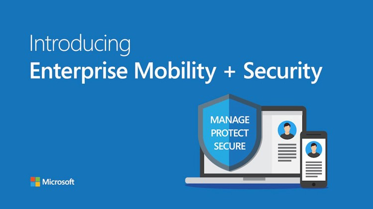

# Microsoft Cloud Administration With Entra  ( Azure )
## Overview
Welcome to my home lab setup! "Dashershomelab" I've created this environment to learn and understand various aspects of networking, monitoring, prevention, administration, and hardening techniques. It's been an incredible learning experience, and I'm excited to share my setup with you.

### Microsoft Enterprise Mobility + Security 
- **Privileged Identity Management** 

## Purpose
My home lab serves as a hands-on environment for:
- Learning networking concepts and technologies.
- Practicing monitoring, prevention, and administration techniques.
- integration of cloud services with on prem devices
- Security implementation on both platforms by a single control manager.
   
<!--# Home Lab Setup-->
<b>this lab focuses on Privileged Identity Management + Security using Microsoft Entra and integral services</b> 

 
