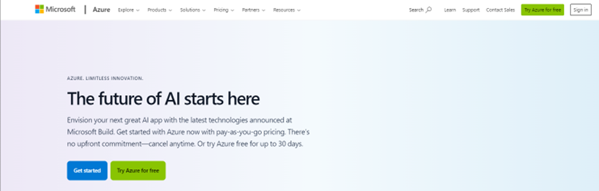

# Microsoft Cloud Administration With Entra  ( Azure )
## Overview
Welcome to my home lab setup! "Dashershomelab" I've created this environment to learn and understand various aspects of networking, monitoring, prevention, administration, and hardening techniques. It's been an incredible learning experience, and I'm excited to share my setup with you.

### Microsoft Enterprise Mobility + Security 

 

## Purpose
My home lab serves as a hands-on environment for:
- Learning networking concepts and technologies.
- Practicing monitoring, prevention, and administration techniques.
- integration of cloud services with on prem devices
   
<!--# Home Lab Setup-->
- # Privileged Identity Management + Security

  
<b>This lab focuses on Privileged Identity Management + Security using Microsoft Entra and integral services</b> 
<b>As we all know Azure AD has been renamed as Entra and Entra ID and throughout this lab ill be referring as Entra ID. 

### Goal in this lab is to:
- Understand Microsoft Cloud Administration
- Microsoft Entra ID – (Azure AD)
- Microsoft Privileged Identity Management (PIM)

### prerequisites for this lab:

- Azure account and Subscription
- EMS + E3 (Enterprise Mobility and Security) Licence
- windows 10 or later PC managed by Intune / Entra

### create Azure account

- Create an Azure Account
- Open https://Portal.azure.com  and create an account.
- Follow the instructions and register. You will get access to Azure portal with $200 credit for one month.
- Once logged in with your Microsoft login credentials you will find the Azure Home page.

 

 

- Click on the subscription and you will find the details.
- you can also find cost analysis of the services and resources.
- You can click on the Microsoft Entra ID, and it will take you to the Entra ID admin Centre.
- Now to manage devices and users we need to buy a license.
- These licenses can be purchased from either Entra admin center or Microsoft 365 Admin center.
- You need to be the domain admin to purchase the license.
- You can go to the M365 Admin center by typing  https://Admin.microsoft.com
- Once you open the M65 amin center home page, navigate to Billing on the left menu and you will see the purchase licenses menu. Click on that and you can purchase required licenses.
- The one license we need id the EMS (Enterprise Mobility and Security) + E3 license.
- Once you purchase the license you will be able to use it by assigning it to a user.
- There are two Variants EMS + E3 and EMS + E5 (I am using EMS + E3 Trial version ). 
- The differences between E3 and E5 apart form the cost are:
 
| EMS + E3                       | EMS + E5                        |
| :--:                           | :--:                            |
|Identity and access management  |	Identity and access management |
|Endpoint management             |	Endpoint management            |
|Defender for Identity           |	Defender for Identity          |
|                                | 	Defender for Cloud and Apps Identity|

 
The products included in the license are:
1. Products
2. Microsoft Entra ID
Microsoft Intune (Microsoft endpoint manager)
3. Compliance admin console
4. Defender for cloud
5. Defender for Identity
6. Purview Information Protection
7. Privileged Identity management (PIM).
8. Secure Score
 
### Microsoft 365 admin center 
You can enter by typing: https://admin.microsoft.com

- When you first create an account with Microsoft Azure or M365 console an Entra ID is provisioned.
  - Entra ID as we know is the new name for Azure AD. So, from now on I’ll be referring to Azure and Azure AD as Entra and Entra ID respectively.
- Entra Id provides the following features.
- Secure Identity Management
	- All other EMS products are reliant upon proper setup of Entra ID.
	-  Automatically creates a database with all types of users when Azure AD and M365 accounts are created. 
- Enhanced Cloud Security
	- It provides a enhanced cloud security to keep all users safe from hackers.
- Single Sign On (SSO)
	- For members signed into a computer as a member of a Domain or Entra ID, it automatically signs you into office 365 apps including outlook.
- Multifactor Authentication (MFA)
	- Users can be assigned with MFA (Multi Factor Authentication), which can be something you have, something you are and something you know. Common are mobile and fingerprints and face identification.
- Identity protection
	- This protects the user’s identity from being stolen.
- Role Based Access Control (RBAC)
	- The RBAC allows admins to set up junior administrators with various roles based on necessity and this avoids a global admin or admin with higher privileges active on the network. This is one of the best practices and provides only users and admins with least privilege active, providing additional security. 
 
By having a single place to authenticate we can automatically be able to use web services and mobile applications on our mobile devices or clients PCs, devices with multiple different operating systems.

- Once the licenses are applied it will take a few minutes up to 30 minutes to complete licensing the user.
- To view all the available admin center’s for the selected user with a proper license click on the all-admin centres on the left side menu

### Active Directory Synchronisation To Entra ID
Since we all have a windows server on premises with Active Directory services running, it is important and more practical to sync our Active Directory to the Microsoft Entra ID. Microsoft has allowed this possible by providing a synchronisation tool. This tool syncs all users on prem and in the Cloud. Keep in mind that the built in users on Active Directory are not synced.
I have my Active Directory services running on my windows server 2022. Since I created this server for a previous lab and the domain name is referring to a local domain (AD.DASHERSWINLAB.local), I may have some sort of issues syncing because of two different domain names. So, I have to perform some additional steps, which is a good learning process as it is possible to have different domain names in reality. Microsoft also has acknowledged this and provided some options, which you will see below.

To make this happen follow the steps below.

- Go to Microsoft download centre and download the Entra connect tool.(it’s still called Azure AD connect)
https://download.microsoft.com/download/B/0/0/B00291D0-5A83-4DE7-86F5-980BC00DE05A/AzureADConnect.msi

- Then run the tool in your Windows server and install the tool.
- Agree to the terms and install it.
- After installation run the tool.

- You can use customize option or Express settings. I’ll use the express settings.

- It asks you to login with Entra ID global admin account.
- So Login with your Entra ID admin credentials.

- My account is setup with MFA so it will ask me for Microsoft credentials

- Once entered it will then ask for the approval from authenticator app.
- Go to the authenticator app on the phone and key in the number and say yes.
- After verification it will then allow the sign in to continue.

- Now it asks you to login to the Active Directory domain administrator credentials.
- Once you enter and press next it will continue to configure.

- Check the box which says start synchronisation when configuration completes.

- It presents with a warning about the UPN Domain suffix not matching the Entra ID domain suffix.
- Its right because my on prem domain is a local one (AD.DASHERSWINLAB.local) it has to be (“XX.com”).

- So, to fix this I can either enter a Domain I own, which I don’t, or you can add the suffix.com to the domain. 
- So ill open the Active Directory Domains and Trust menu on my server.
- This provides me an option to add alternate UPN Suffixes. 
- I’ll go ahead and add “dasherswinlab.com” and “securedasher.onmicrosoft.com” to the list.
- Also ill make sure the on prem users have the Alternate domains connected.

- I’ll continue the installation of the connect tool and it and the warning slightly changes, and it gives me an option to continue without matching all UPN suffixes to verified domains.

- Check the box and hit next and it will complete the configuration of Entra connect tool.
- Now it completes the configuration successfully and asks you to verify the user accounts.

- The Microsoft Entra Connect website has been updated recently, below is the older version with the link to the new Microsoft Entra Connect link. Click on it and it should take you to the new website.

- This is the new updated Microsoft Entra Connect web page.
- Click on the Connect sync option and it will provide details of the synchronisation between Active Directory and Entra ID. Also there are other options required for hybrid management.

- We will use Privileged Identity management.
- The use case of this is when a certain activity has to be carried out and it needs a admin role. 
Yes a administrator can carry out this activity but some or most cases the admin is either not available or has a busy schedule. Also we want to have better security we as a best practice keep the admin roles inactive unless necessary. To cater to these situations we have junior admins or users who can be provided the admin privilege to carry out these activities. This process has to be very carefully administered and monitored, so that we don’t let the privilege escalation turn against our security practices. Microsoft Entra ID allows us to carry out this PIM (Privileged identity Management) in a controlled manner. There is a feature called just-in-time access which allows us to provide the escalation. 

 Users, groups or Devices can be managed using PIM.

- Just-in-time access
	- Provide only just in time access to some services when required
	- For example, a junior sys admin can get rights to manage user for a particular time slot.
	- It can be enforced with MFA.
	- The access needs to be justified by the user requesting it, or by the admin providing this access.
	- These access and actions need to be notified to a system admin or management.
	- The request can be either accepted or rejected.
	- These actions are monitored and audited  and allows Auditing of these access by both user and admin.
	- Prevent last admin removal, this is a safety measure which occurs by default without which no one will be able to make any changes.
 
- Let’s provide a junior admin with permission to modify user settings as an example.
- To check a user roles we can go to Microsoft Entra admin center.
- Click on roles and admins.
- You will be provided with the administrative roles present in Entra.

- Clicking on the role will provide you the users assigned the role. As you can see the gloabal admin role assigned to user Rajeev raman.
- Further clicking on the role settings provide you the details of the role, like the max duration its assigned, whether MFA is required and whether it needs to be approved, etc...

- Lets check the user admin role. We can see its not currently assigned to anyone.

- The role settings show the details which we can edit if required, say or example the time duration is 8 hours which is a way too long. We can reduce it to a more realistic 2 hours. 
- It can be done by the user requesting as well, which is what well do.
- Tick the required check boxes, I’ll tick “require justification on activation” and “require approval to activate”.
- I’ll request MFA which is a best practice, as I am eager to see how it works.

- Since require approval to activate is checked, we need to select an approver member.
- Click on the Select approver(s) + and it will provide the available users.
- I have selected the global admin Rajeev Raman , an ill click on update.

Now we can see that it shows 1 member as approver and the details of the member.

- Click on the Assignment tab and you can see by default a few values and options are preset.
- We do not want to allow permanent eligible assignment and permanent active assignment as it will work against the security best practice.
- Change the value to 6 months for expiration of eligible assignments.

- Click on the Notification tab and find there are fields for email notification and who should get the notifications and for notifying additional members.
- We pretty much leave them all checked.
- Once done click update and its done.

For this demo I’ll just create a junior admin with no roles assigned.

- Go to Microsoft Entra admin center.
- I’ll click on users / Roles and admins / all roles/ and select user administrator.
- Then click on the + Add assignments option.
- Select a member and in this case I’ll select junior admin.

- After selecting a member, click on settings and it will show us the details.
- Select the assignment type , which is “Eligible”. So the user can request when needed.
- Click on assign and it will be assigned to junior admin.

- Now if we click on the user administrator and assignments we can check.
- Click on Eligible assignments and junior admin should be listed in there.
- So now junior admin can login and request for a eligible role.

You can also check this from the user profile in assigned roles.

- Now that we have confirmed the junior admin has a eligible role assigned lets log in to Entra using junior admin credentials.

After password change a first time login is initiated and a page welcomes the user.

- After logging in the Azure portal is opened with available resources.

- We’ll locate Microsoft Entra ID and click on it to open Entra admin options.
- It opens all services and details locate the Privileged Identity Management.

- Click on the privileged Identity Management card available down the page.
- On this page we can find the option Activate just in time. Click on the Activate button.

Since we have set up for a password change on login junior admin has to change his password.

- It opens up the Microsoft Entra roles and, lets click on the Eligible Assignments.
- We will find the User Administrator role available to activate, and the end time.
Click on Activate.

Since we requested MFA for this activation additional requirements window pops up. 

Follow the prompts and once password is entered to sign in, the MFA window pops up. 

- Since this is the first time the Authenticator app has to be installed and setup.
- Just follow the prompts and complete the authentication.

- Once the authentication is done you will be directed back to the activation of user administrator role.
- Since it was set to 8 hours by default I’ll set it to 2 hours.
- I’ll have to provide a reason for the role activation. I just entered “need to change user properties”.
- Click on the activate button and you will be notified as waiting for approval. 

- The Global admin Rajeev Raman receives a notification for role activation.
- Now I’ll open the Privileged Identity Management option and click on approve requests.
- There is a junior admin requesting for a user administrator role and given a reason.

- This opens up a approve request for the junior admin.
- I need to provide a justification for activating the role.
- Then ill click on confirm

- This approves the request to give junior admin the user administrator role for 2 hours.
- If we go back to the junior admin login and check we can see the Active assignment should be populated with the role activated.
- Now the junior admin can use the role to do what he intended to do.

- Lets open users and choose an user Peter parker. This user has no contact details and so lets complete the details.
Ill fill up the contact details and save the changes.

Clicking on the user peter parker I can see the changes have taken place. This confirms that the role is working correctly as intended.

- As I have no more changes to make ill go ahead and deactivate the role.
- Deactivation does not have to be after the time, it is a best practice to deactivate it after the purpose is met.
- Once I click on deactivate the deactivation process starts.

After deactivation the role gets populated in Eligible assignments.

- Since as accountability is a security requirement, these actions have to be logged.
- We can go to the audit history in the Privileged Identity Management console and view the events.

Clicking on the events give you more details, as to the requestor, was it successful, and the timestamp.

- These logs can also be monitored by the admin in a different perspective.
- All details can be viewed by clicking on the event.

## References and Links: 
- The Microsoft Intune documentation is an excellent guide for using Intune
- https://learn.microsoft.com/en-us/mem/intune/
- This is a visual guide to the enrollment of devices based on platforms
- https://download.microsoft.com/download/e/6/2/e6233fdd-a956-4f77-93a5-1aa254ee2917/msft-intune-enrollment-options.pdf
- This is a template for Intune deployment planning, design and implementation table.
- https://download.microsoft.com/download/7/1/5/7151c8de-6b23-4aa7-8a63-a914844a5f1b/IDPDIG%20-%20Table%20templates.docx
